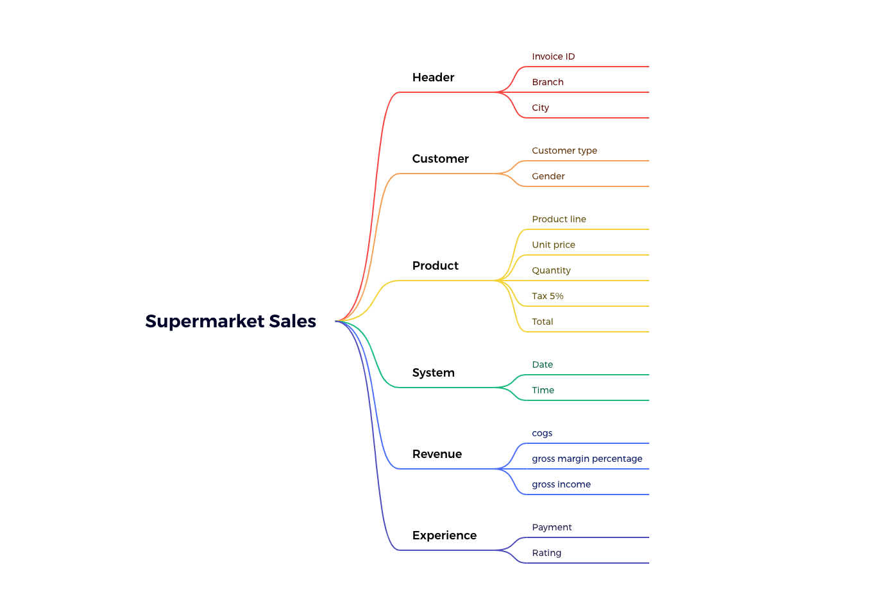

# Supermarket_data
Explorative analysis of a supermarket sales data set from Kaggel

## Source
https://www.kaggle.com/datasets/aungpyaeap/supermarket-sales

## Tools

* Jupyter Lab

* Python ( Pandas, Numpy, Seaborn, Matplotlib )

* Xmind

## Data Columns

## Equations

cogs = Unit price * Quantity

Tax 5% = cogs * 5/ 100

Total = cogs + Tax 5%

gross income = Total * gross margin percentage/ 100

All products have the same gross margin percentage

## 1. Does products of the same product line have the same unit price?

* Products of the same product line have different prices. >> One product line does not represent one product.

* Since each invoice only has one unit price, all extracted invoices are of monotypic product sales.

* In the selected dataset 99% of the products have unique unit prices. Only 1% are repeated prices.

* Since most items have unique unit prices one could say for each unique product most of the time (99% of the time)only one invoice was extracted from sales of that specific product.

* There is a possibility that all* of the products in the dataset are unique and the 1% of the time where the unit price is repeated may be due to more than one product bearing the same price.*

** Maybe this dataset is a subset of all the sales made at each store.

** i.e.: For each store, extract one invoice where the customer bought only one type of product( Qty can be many) and product unit price is unique.

##  2. Which City/ Branch sold the highest quantity of products?

* Sales quantities are almost equally divided among the three cities/branches.

## 3. Which City/Branch earned the highest gross income?

* Total gross income is also almost equal in the three cities/branches.

* Only Naypyitaw has a slight increase of ~208 (1%)

## 4. Gross income by product line

* Gross income percentage of each product line is around 17%

* "Health and beauty" is considerably below average (15%)

## 5. Gross income by product line by City/Branch

* Both total gross income and the percentage gross income of each product line when isolated by the city shows a considerable variance. 

** Might be a good parameter to explore later

## 6. Total revenue by payment type

* There is relatively low amount of credit card revenue compared to Ewallet and Cash. About 3% less

* Mandalay has highest revenue through credit card payments. This is only a small increased relative to the other payment methods. Lowest in Mandalay is Ewallet.

* Naypytiw has highest revenue through cash payments. This is significantly higher than other methods.The lowest method of revenue in Naypyitaw is through credit card.

* Yangon has highest revenue through Ewallet. The other methods seem to have relatively equi amounts.

## 7. Men are more likely to purchase high price low quantity products.

When average quantity and average unit price is considered against gender for all records;

* Average sales quantity by females is slightly higher than males, a difference of just 0.43

* Average unit price of sales by males is slightly higher than females, a difference of just 0.82

When average quantity and average unit price is considered against gender for records grouped by cities/supermarket branches;

* The differences are more visible. eg: In Naypyitaw average sales quantity has a considerable gap between males and females. (0.68, compared to 0.43 overall value)

* Some cities show opposite patterns to overall pattern. eg: In Yangon average unit price sales by females is higher than males.